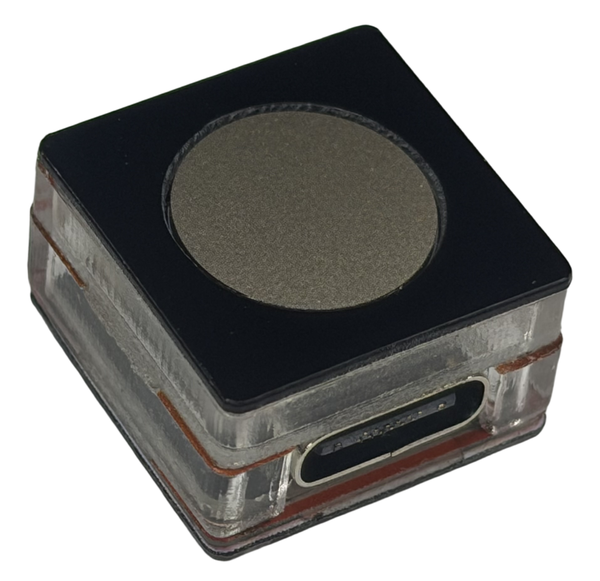
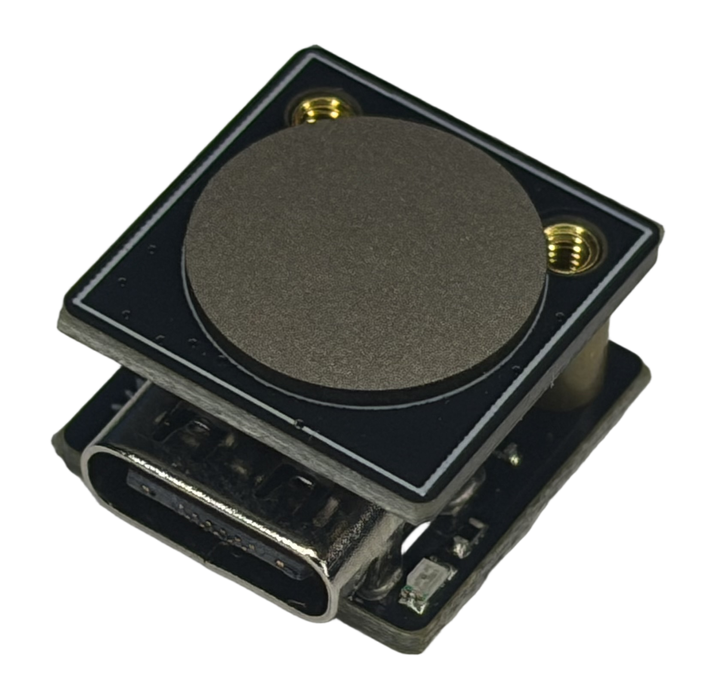

## 指纹模块使用手册

 [English Version](./README.md)

---

---

###### 成品外壳版（配数据线+保护外壳）-- WindowsHelloPackage1

整机成品配备高品质防滑 保护外壳与专用 USB 数据线，即插即用。设备防尘、耐摔、做工精良，适用于日常桌面使用与外出便携携带。无需额外配件，开箱即用，适合普通用户日常指纹解锁使用。

---

---

###### 裸板 DIY 版本（仅指纹主板）-- WindowsHelloPackage2

纯电路板设计，无外壳、无数据线，体积超小。适用于 DIY 改装、嵌入式开发、设备集成、工控设备改造以及机箱内置改装场景。性价比极高，可满足技术爱好者与专业开发者的个性化定制需求。

---

---

### 📌 产品简介

WeActStudio Windows Hello 指纹模块是一款**微软原生认证 USB 生物识别设备**，标准 HID 协议，免驱设计。插入电脑即可由 Windows 系统自动匹配、下载、安装官方生物识别驱动，无需第三方驱动工具，即插即用，完美适配 Windows Hello 指纹解锁与系统登录功能。

### ✅ 适配平台

Windows 10 / Windows 11（x64）

*目前暂时不支持 Android、macOS、Linux 系统*

### 🚀 使用步骤

1. **硬件连接** 将模块 USB 接口直连电脑原生 USB-A 接口，不建议使用集线器、延长线，避免供电不足导致识别异常。

2. **自动驱动安装** 联网状态下，系统自动下载并安装生物识别驱动，等待 10–300 秒，右下角提示设备就绪即可。

3. **驱动校验** 设备管理器 → 生物识别设备，正常显示设备、无黄色感叹号即为安装成功。

4. **录入指纹** 系统设置 → 账户 → 登录选项 → 指纹识别(Windows Hello)，按指引完成录入，即可指纹解锁登录系统。

### 🔧 故障排查

- **插入无反应**：更换原生 USB 接口、开启 Windows 更新、重启电脑重试

- **驱动异常/感叹号**：卸载异常设备并删除驱动，重启自动重装；或手动安装离线驱动 `Driver/MOC-release-signed-4.0.105.5`

- **无法识别 Hello 设备**：更新系统、重启 Windows Biometric Service 服务、清空旧指纹重新录入

### 💡 注意事项

- 首次使用建议联网，保证系统可正常获取官方驱动

- 建议不要频繁热插拔，防止瞬时电流损坏传感器

- 请勿使用第三方驱动工具，避免协议冲突导致功能失效

### ✨ 产品特性

- **原生免驱**：Windows 系统原生支持，全自动部署驱动

- **安全可靠**：微软标准生物识别协议，系统级安全加密认证

- **极简易用**：即插即用，无需配置，开箱即用
